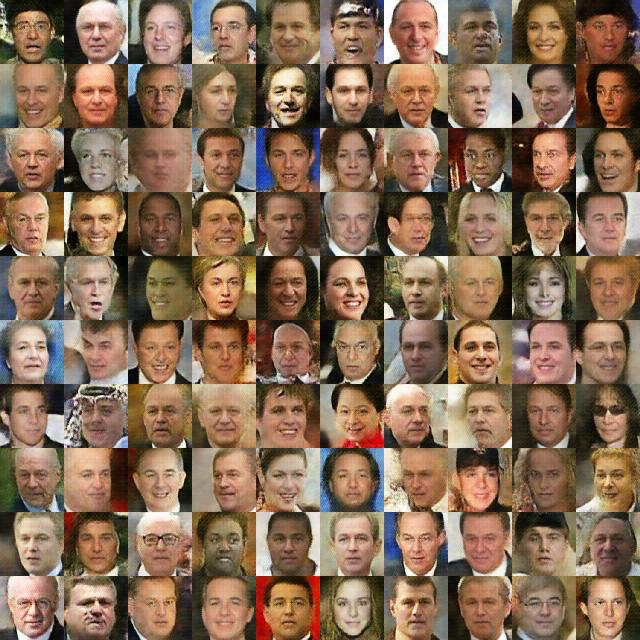
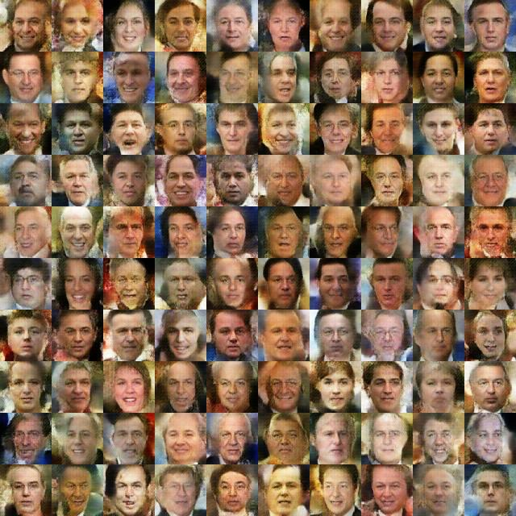

# VAEGAN
This is a code for generating images with [VAEGAN](http://arxiv.org/abs/1512.09300) (variational autoencoder + generative adversarial net).
Its original code is [[1]][[1]].  
Our implementation is done using [Theano](https://github.com/Theano/Theano).

## Demonstoration
Download [Labeled Faces in the Wild](http://vis-www.cs.umass.edu/lfw/) dataset, split it into train and test datasets, and train VAEGAN.

```
python get_lfw.py
python train.py configures/lfw.json
```

To monitor the progress of training, it morph face images reconstructed on the training dataset (Fig. 1) to randomly generated face images (Fig. 2).

  



Using the following command after training, we can make VAEGAN generate images that represent the morphing (Fig. 3) between randomly choosen two images from the test dataset (left and right end).

```
python morphing.py configures/lfw_morph.json
```

  

The parameter that generates above images is available from [here](https://drive.google.com/file/d/0B2qtm5RDP8ZMUWdZeWxmRUVwUVE/view?usp=sharing).

## Optimization tips

- The optimization procedure is composed of two phases. In early phase, we pretrain VAE using pixel-wise error and discriminator separately.  
  In final phase, we train ovenall VAEGAN model as in [[1]][[1]]. 

- We use the ADAM to train models in our example (eta=1e-3, beta1=0.9, beta2=0.999, epsilon=1e-8).

- Depending on the probabilities of real/fake as real/fake on a minibatch at an each iteration, we change the cost that should be optimized as done in [[2]][[2]].

## References
[[1]] https://github.com/andersbll/autoencoding_beyond_pixels  
[[2]] https://github.com/skaae/vaeblog

[[1]]:https://github.com/andersbll/autoencoding_beyond_pixels  
[[2]]:https://github.com/skaae/vaeblog
